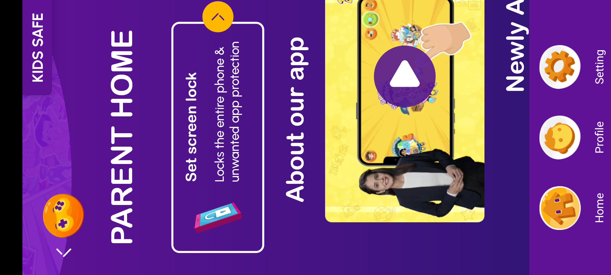
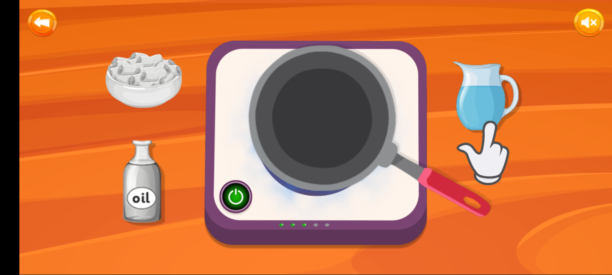

# Little Singham: Play & Learn — QA & UX Review with Screenshots

## 1. Overview & Basic Details
- **Game Name:** Little Singham: Play & Learn
- **Package Name:** `com.ct.littlesingham`
- **Target Audience:** Early Childhood / Preschool & Primary (Ages 3–8)
- **Engine / Architecture:** Native Android wrapper embedding interactive Web/HTML5 activities (`GameViewActivity` via Android `WebView`).

---

## 2. Evaluation Parameter Checklist

| Parameter | Status | Visual Reference | Key Details |
| :--- | :---: | :---: | :--- |
| **Splash Screen / Launch** | ✅ Pass |  | Creative Galileo splash with progress loading bar. Smooth entry into main hub. |
| **Orientation (Landscape)** | 🔄 Hybrid |  | Main child dashboard and all gameplay run strictly in **Landscape** mode (2400×1080). |
| **Orientation (Portrait)** | 🔄 Dynamic |  | Parent zone dynamically rotates phone to **Portrait** mode (1080×2400). |
| **Parental Gate** | ✅ Pass |  | Arithmetic challenge (`55 + 6 = 61`) protects parent zone and in-app purchases. |
| **Audio Settings (BGM)** | ✅ Available |  | **Preferences > Background Music** toggle switch (Global On/Off). |
| **Master / SFX / Voice Sliders** | ⚠️ Partial | — | No separate sliders for Master, SFX, or Voice; system hardware volume is used. |
| **In-Game Audio Toggle** | ✅ Available |  | Quick speaker button at top-right switches to muted speaker icon (`✕`). |
| **Navigation: Back & Next** | ✅ Present |  | Circular orange Back button on top-left (`<`); carousel Next/Prev arrows in menus. |
| **Level Progress & Stars** | ✅ Present |  | Vertical filling progress bar alongside incremental golden stars (1, 2, 3 stars). |
| **Confetti & Celebration** | ✅ Present | — | Animated visual praise and star triggers upon concluding each interactive activity. |
| **OST for Title & Instructions** | ✅ Present | — | Upbeat Indian cartoon soundtrack; audio prompt button for replaying verbal instructions. |

---

## 3. Visual Walkthrough & Evidence

### 3.1 Splash Screen & Main Child Dashboard
The game launches with an animated progress bar and brings the child into a colorful, horizontal interactive world.

  
  

### 3.2 Parental Gate & Parent Zone (Dynamic Portrait Switch)
Accessing parent settings requires solving a math puzzle. The app smoothly rotates from Landscape to Portrait mode.

  
  

### 3.3 Audio Settings & In-Game Mute Controls
Background music toggle is located under Parent Preferences. Inside gameplay, a direct speaker icon allows kids or parents to mute all sound instantly.

  
  

### 3.4 In-Game Navigation & Progression (Stars & Levels)
Top-left orange back button, next/prev carousel arrows, and a vertical progress tracker showing earned golden stars.

  
  

