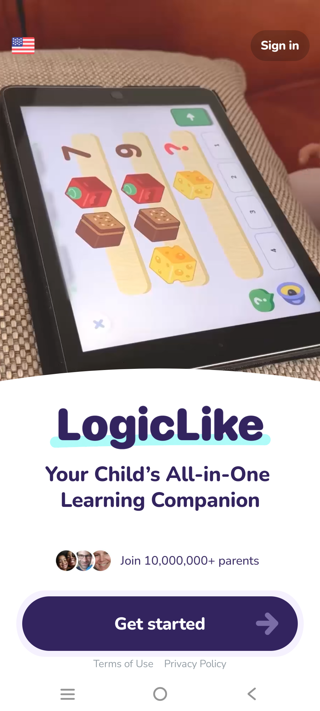
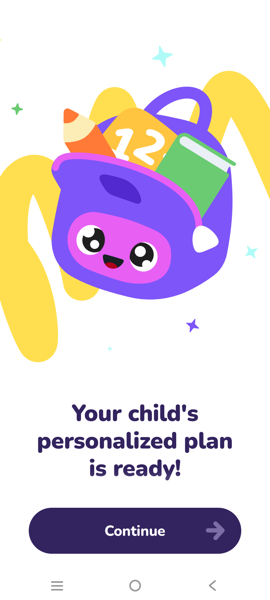
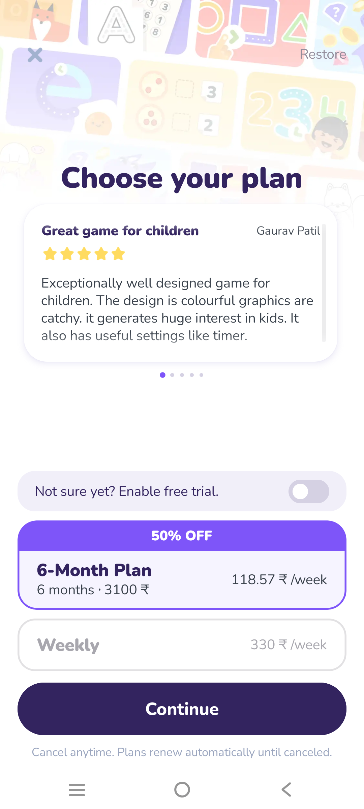
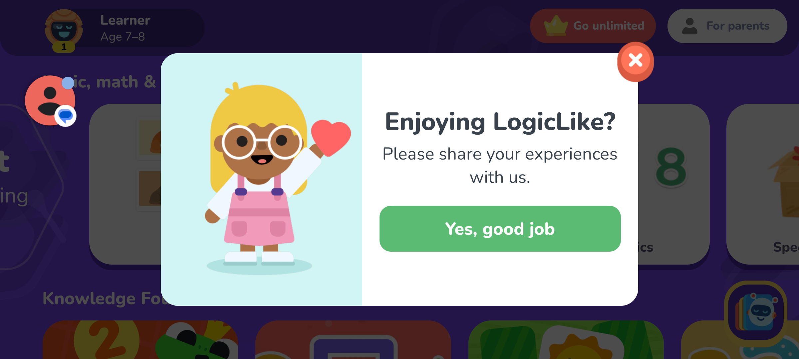

# LogicLike: ABC & Math — QA & UX Review with Screenshots

## 1. Overview & Basic Details
- **Game Name:** LogicLike: ABC & Math
- **Package Name:** `com.logicappkids`
- **Target Audience:** Children aged 4–12 (Math, Logic puzzles, ABC & Reasoning)
- **Engine / Architecture:** Modern native app with custom 2D rendering and responsive UI engine.

---

## 2. Evaluation Parameter Checklist

| Parameter | Status | Visual Reference | Key Details |
| :--- | :---: | :---: | :--- |
| **Splash Screen / Launch** | ✅ Pass |  | High-end video demonstration showcase with "Get Started" and "Sign in" buttons. |
| **Orientation (Portrait)** | 🔄 Hybrid |  | Onboarding wizard, subscription paywall, and Parent zone operate in **Portrait** mode. |
| **Orientation (Landscape)** | 🔄 Hybrid |  | Main child learning track, courses, and interactive puzzles rotate to **Landscape** mode. |
| **Close Button ('X')** | ✅ Present |  | Top-left 'X' on paywalls, gameplay puzzles, and coral-red top-right 'X' on exit feedback modals. |
| **Parental PIN Gate** | ✅ Pass |  | Word-to-digit challenge (*"THREE FIVE SIX"*) with numeric keypad and cancel button. |
| **Audio Settings (Music)** | ✅ Available |  | Dedicated **Music** toggle switch in Parent Settings (Global On/Off). |
| **Voice Replay Button** | ✅ Present |  | Speaker icon in bottom-left re-reads instructions loudly and clearly. |
| **Scores & Star Rewards** | ✅ Present |  | Immediate numerical reward (`+4 ⭐`) with glowing halos and star counters. |
| **Confetti & Particle FX** | ✅ Present |  | Blue, purple, and gold star confetti shower celebrating correct answers. |
| **Exit Flow & Modals** | ✅ Present |  | Tapping top-left Close button triggers friendly exit dialog before navigating to hub. |

---

## 3. Visual Walkthrough & Evidence

### 3.1 Onboarding Splash & Setup Wizard (Portrait)
Starts in Portrait orientation with video previews, mascot progress bar, and "Continue" next buttons.

  
  

### 3.2 Subscription Modal (Close 'X') & Landscape Child Hub
Paywall features an explicit close 'X' button. Entering the main curriculum automatically switches the screen to Landscape.

  
  

### 3.3 Parental Gate & Audio Music Settings
Parent zone is protected by an English number PIN and contains global background music toggle.

  
  

### 3.4 Interactive Puzzle Gameplay (Voice, Close 'X', Confetti & Score)
Features top-left Close button, bottom-left audio speaker for re-reading instructions, and energetic `+4 ⭐` star confetti on correct answers.

  
  

### 3.5 Exit Confirmation Modal
Smooth exit flow with rating/feedback overlay and dismiss button.

  

