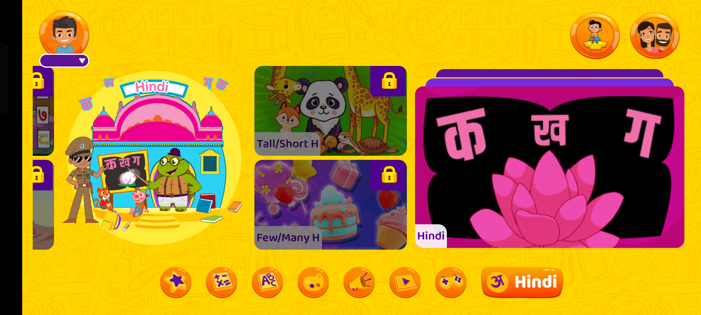
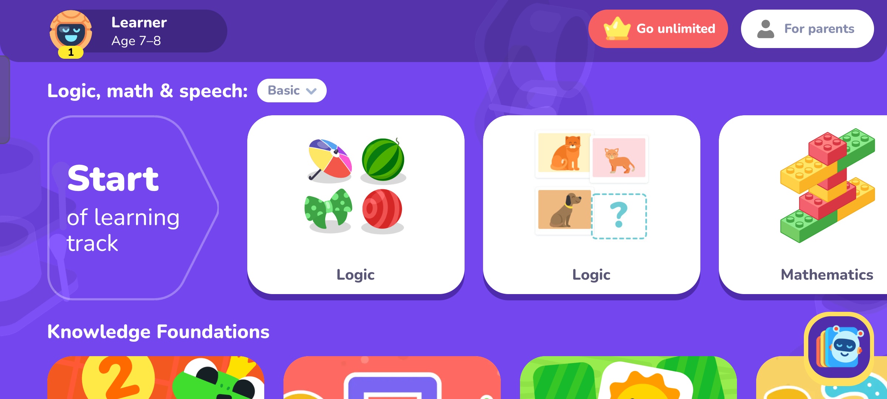
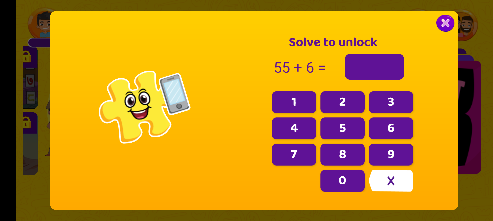
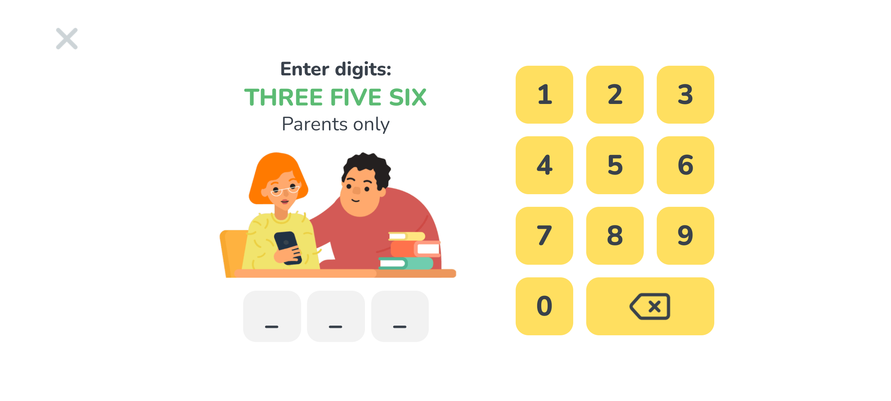
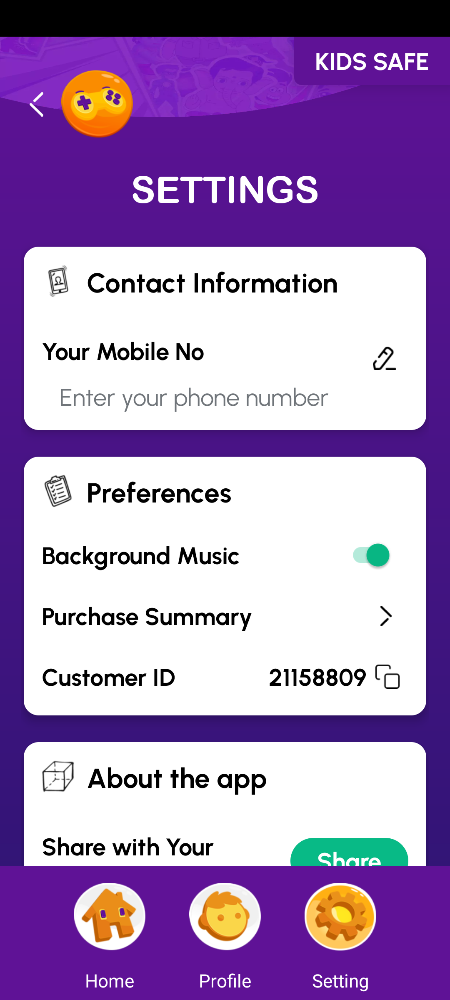
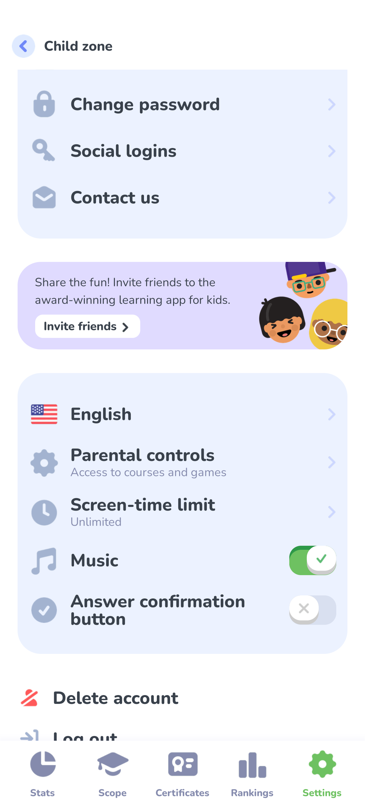
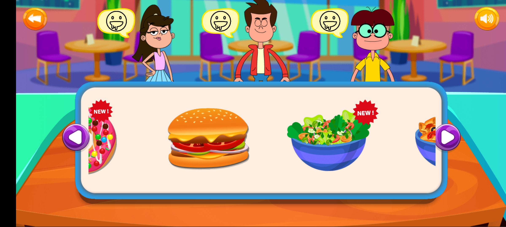
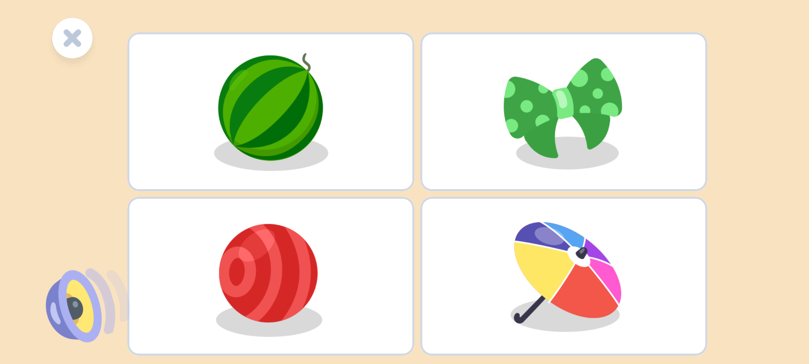
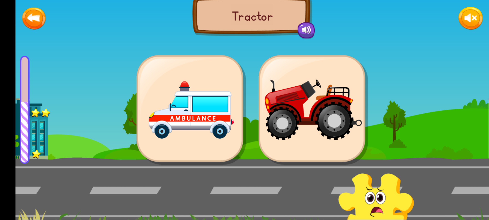
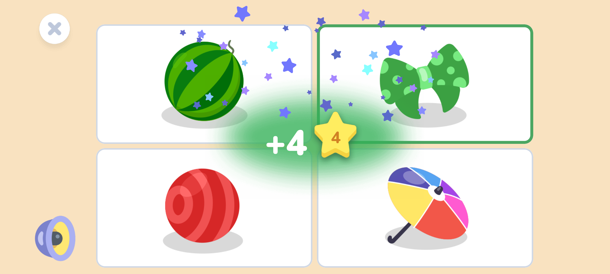

# Kids Games QA & UX Comparison Report

Comprehensive side-by-side evaluation of **Little Singham: Play & Learn** and **LogicLike: ABC & Math**, conducted via direct live testing on a physical Android device.

---

## 1. Feature Comparison Table

| Evaluation Parameter | Little Singham: Play & Learn | LogicLike: ABC & Math | Key Differences & Winner |
| :--- | :--- | :--- | :--- |
| **Game Launch / Splash Screen** | Creative Galileo splash with horizontal progress bar. | Interactive video showcase with mascot-led setup wizard. | **LogicLike** offers higher visual polish and interactive onboarding. |
| **Orientation Handling** | **Hybrid:** Landscape for gameplay (2400×1080), Portrait for parent settings (1080×2400). | **Hybrid:** Portrait for onboarding/paywalls (1080×2400), Landscape for learning hub & puzzles (2400×1080). | **Tie:** Both intelligently use Landscape for kids' play and Portrait for parents. |
| **Audio Settings (BGM)** | Dedicated Background Music toggle in Parent Preferences. | Dedicated Music toggle in Parent Settings. | **Tie:** Both offer clean global toggle switches. |
| **SFX / Master / Voice Settings** | No separate volume sliders; relies on hardware keys. Replay button for spoken words. | No separate volume sliders; relies on hardware keys. Replay button for spoken instructions. | **Tie:** Both simplify controls for kids and provide audio voice replay buttons. |
| **In-Game Mute Control** | Quick speaker toggle icon at top-right of HTML5 activities. | No direct in-game mute (handled via parent settings). | **Little Singham** provides faster kid/parent access to mute without going to settings. |
| **Close Button ('X')** | Present on modal dialogs, parental math gate, and drawers. | Highly prominent across gameplay screens, paywalls, and feedback modals. | **LogicLike** has more standardized Close buttons. |
| **Home Button** | Present in Parent Zone bottom bar; gameplay exits via Back button. | Exit button ('X') directly navigates back to learning track hub. | **LogicLike** provides quicker return to home hub. |
| **Next / Continue Button** | Carousel arrows (`<` / `>`) and automatic progression. | Large dark blue "Continue" buttons with forward arrows (`→`). | **LogicLike** offers clearer calls-to-action during flows. |
| **Back Button** | Prominent orange circular back button (`<`) on every screen; supports Android back key. | Header back arrow (`<`); supports Android system gesture/hardware back. | **Little Singham** has larger, more toddler-friendly back targets. |
| **Score & Stars** | Star progression alongside filling vertical progress bar. | Direct numerical score (`+4`) accompanied by golden star badge. | **LogicLike** gives clearer gamified reward feedback. |
| **Confetti & Particle FX** | Animated star cues and celebration sounds upon completion. | Vibrant animated star confetti shower and glowing success halo. | **LogicLike** has richer particle animations. |
| **Game Over Experience** | Kid-friendly; no failure screen, friendly retry encouragement. | Kid-friendly; incorrect answers prompt gentle retry guidance. | **Tie:** Both follow best child psychology practices by avoiding harsh failures. |
| **Parental Protection Gate** | 2-digit addition math challenge (e.g. `55 + 6 = 61`). | Word-to-digit number PIN entry (e.g. *"THREE FIVE SIX"*). | **Little Singham** tests math; **LogicLike** tests reading. Both are effective. |

---

## 2. Visual Comparison Gallery

### 2.1 Main Dashboards & Learning Hubs (Landscape)
Both games maximize screen real estate using horizontal landscape presentation for children:

  
  

### 2.2 Parental Security & Settings Gates
Parental verification methods protecting adult settings and in-app purchases:

  
  

### 2.3 Audio Settings Configuration
Clean background music toggle switches located inside the adult settings zones:

  
  

### 2.4 Gameplay UI & Interaction Features
Navigation controls, voice replay prompts, and in-game quick toggles:

  
  

### 2.5 Progress, Stars & Confetti Celebrations
Reward mechanisms on level completion and correct answers:

  
  

---

## 3. Individual Game Review Documents
- 📄 [Little Singham: Play & Learn Full Review](Little_Singham_Play_and_Learn.md)
- 📄 [LogicLike: ABC & Math Full Review](LogicLike_ABC_and_Math.md)
